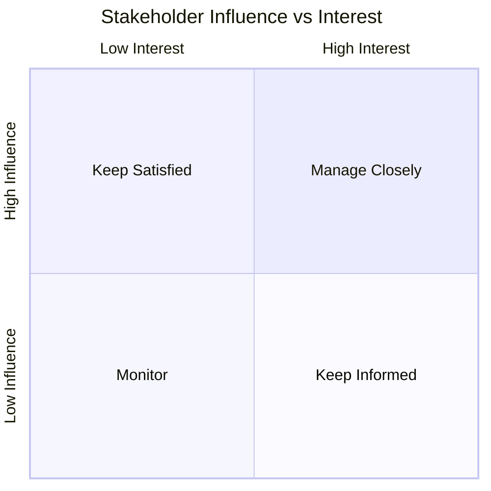

# Stakeholder Identification

> **Standard:** ISO/IEC/IEEE 29148:2018 §5.2.2 — Stakeholder Identification  
> **Last Updated:** 2026-03-09

## Purpose

Registry of all stakeholders with their classification, influence, and communication needs.

## Stakeholder Registry

| ID | Stakeholder / Group | Type | Interest Level | Influence | Primary Concern |
|----|---------------------|------|---------------|-----------|-----------------|
| SH-001 | | Internal / External | High / Medium / Low | High / Medium / Low | |

## Stakeholder Map

## Communication Plan

| Stakeholder | Channel | Frequency | Owner |
|-------------|---------|-----------|-------|
| | | | |
