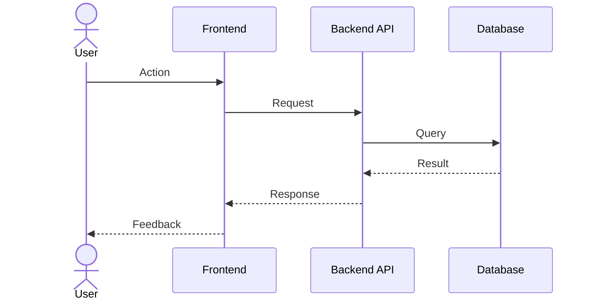

# IF-001 — Template

> **Status:** Template  
> **Date:** 2026-03-09

## Flow Description

<!-- Brief description of the user interaction this flow covers. -->

## Diagram

## Notes

<!-- Design decisions, edge cases, error states. -->

## Traceability

| Type | ID |
|------|----|
| Use Case | UC-### |
| Screen | SC-### |
