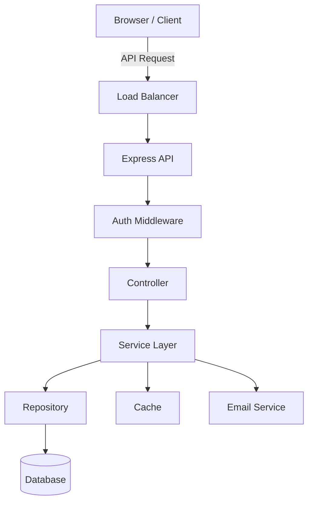

# High-Level Data Flow

> **Last Updated:** 2026-03-09

## Purpose

Documents how data flows through the system at a high level.

## Flow Diagram

```mermaid
flowchart TD
    Browser[Browser / Client] -->|API Request| LB[Load Balancer]
    LB --> API[Express API]
    API --> Auth[Auth Middleware]
    Auth --> Controller[Controller]
    Controller --> Service[Service Layer]
    Service --> Repo[Repository]
    Repo --> DB[(Database)]
    Service --> Cache[Cache]
    Service --> Email[Email Service]
```
