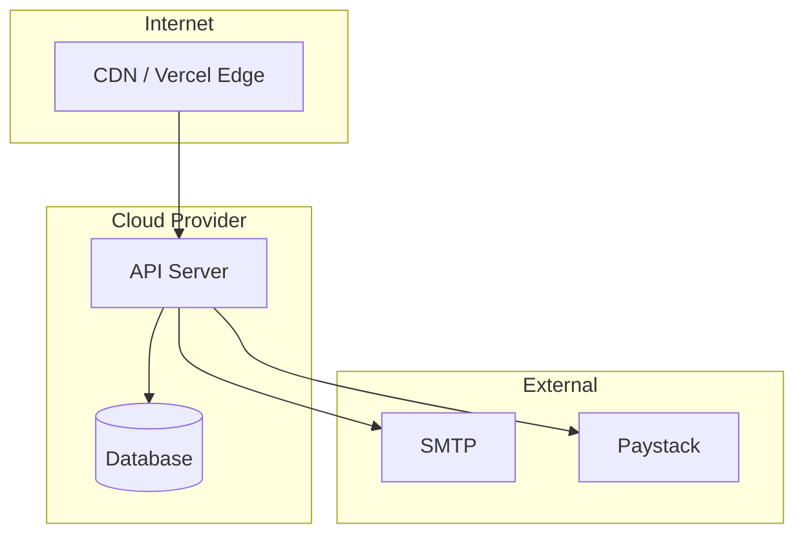

# Infrastructure Model

> **Last Updated:** 2026-03-09

## Deployment Topology

| Component | Platform | Region | Scaling |
|-----------|----------|--------|---------|
| Client | Vercel / Fly.io | — | Auto |
| Server | Fly.io | — | Horizontal |
| Database | — | — | Vertical |
| Email | PrivateEmail SMTP | — | N/A |

## Diagram

