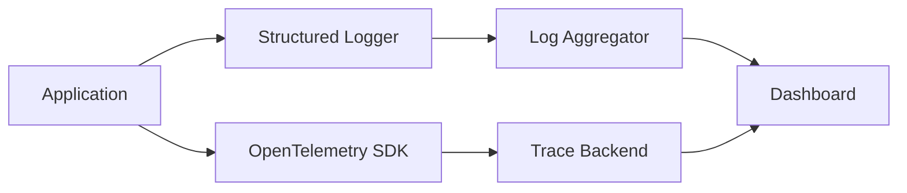

# Observability Architecture

> **Last Updated:** 2026-03-09

## Pillars

| Pillar | Tool | Purpose |
|--------|------|---------|
| Logging | Winston / structuredLogger | Structured JSON logs |
| Tracing | OpenTelemetry | Distributed request tracing |
| Metrics | — | Application-level counters |
| Alerting | — | Threshold-based notifications |

## Architecture Diagram

