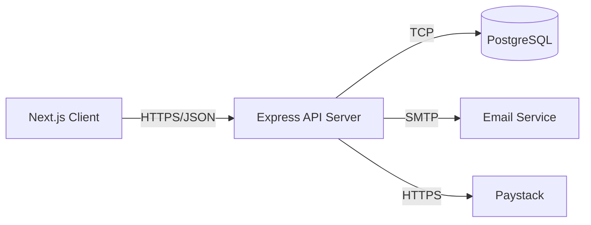

# Service Architecture

> **Standard:** ISO/IEC/IEEE 42010:2022 — Architecture Description  
> **Last Updated:** 2026-03-09

## Overview

<!-- High-level description of the service decomposition. -->

## Services

| Service | Responsibility | Tech Stack | Repository Path |
|---------|---------------|------------|-----------------|
| Client (Next.js) | Frontend SPA | React, Next.js 14 | `client/` |
| Server (Express) | REST API | Node.js, Express, Sequelize | `server/` |

## Communication Patterns

<!-- How services communicate (REST, events, queues). -->

## Diagram

