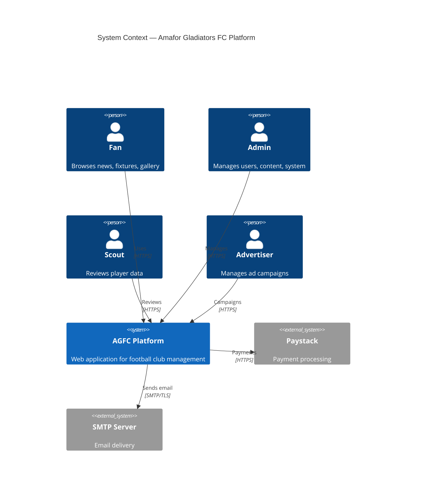

# System Context Diagram (C4 Level 1)

> **Last Updated:** 2026-03-09

```mermaid
C4Context
    title System Context — Amafor Gladiators FC Platform

    Person(fan, "Fan", "Browses news, fixtures, gallery")
    Person(admin, "Admin", "Manages users, content, system")
    Person(scout, "Scout", "Reviews player data")
    Person(advertiser, "Advertiser", "Manages ad campaigns")

    System(platform, "AGFC Platform", "Web application for football club management")

    System_Ext(paystack, "Paystack", "Payment processing")
    System_Ext(smtp, "SMTP Server", "Email delivery")

    Rel(fan, platform, "Uses", "HTTPS")
    Rel(admin, platform, "Manages", "HTTPS")
    Rel(scout, platform, "Reviews", "HTTPS")
    Rel(advertiser, platform, "Campaigns", "HTTPS")
    Rel(platform, paystack, "Payments", "HTTPS")
    Rel(platform, smtp, "Sends email", "SMTP/TLS")
```
