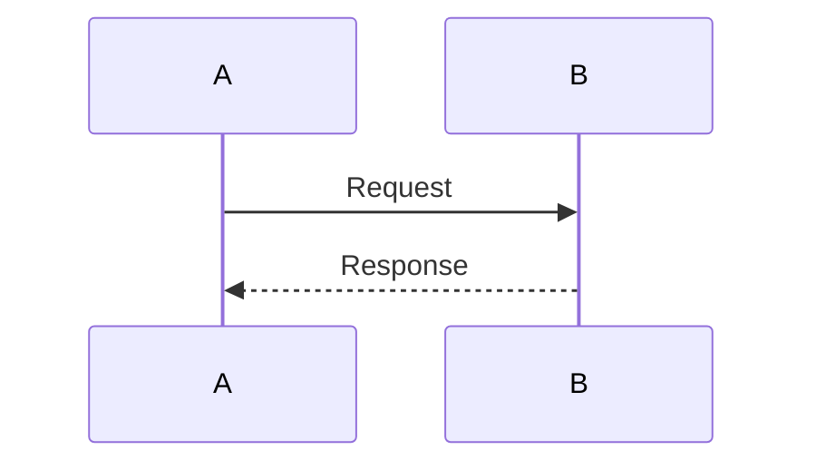

# SD-001: Template

> **Status:** Template  
> **Date:** 2026-03-09

## Flow

<!-- Brief description of the sequence. -->

## Diagram

## Notes

<!-- Edge cases, design rationale, performance considerations. -->
