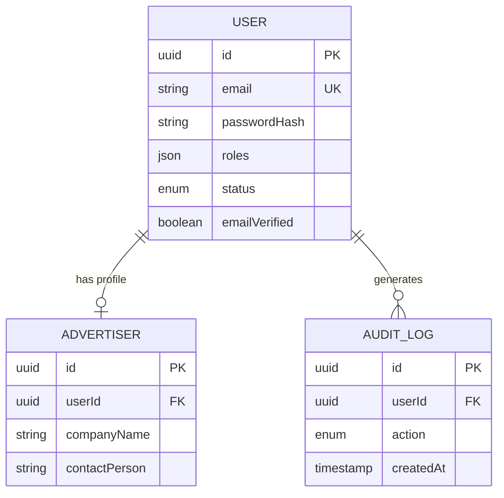

# Data Model

> **Last Updated:** 2026-03-09

## Purpose

Entity-Relationship diagram and schema definitions for the application database.

## ERD

## Schema Notes

- `roles` is stored as a JSON array (supports multi-role)
- All primary keys are UUIDs
- Soft deletes via `deletedAt` timestamp (paranoid mode)
