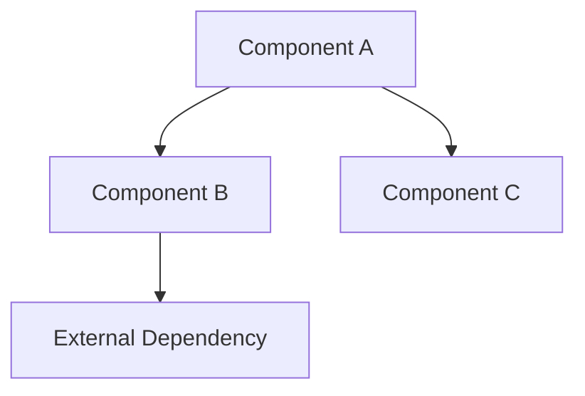

# Component Architecture — {Service Name}

> **Last Updated:** YYYY-MM-DD

## Overview

Describe the internal component breakdown, responsibilities, and boundaries.

## Component Diagram

## Components

### Component A

- **Responsibility:** —
- **Inputs:** —
- **Outputs:** —
- **Dependencies:** —
