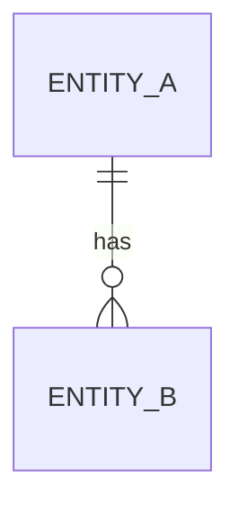

# Data Model — {Service Name}

> **Last Updated:** YYYY-MM-DD

## Overview

Service-local schema, migrations, and ownership.

## Entities

### Entity A

| Column | Type | Constraints | Description |
|--------|------|-------------|-------------|
| `id` | UUID | PK | Primary key |
| — | — | — | — |

## Relationships

## Migrations

| Version | Description | Date |
|---------|-------------|------|
| — | — | — |
