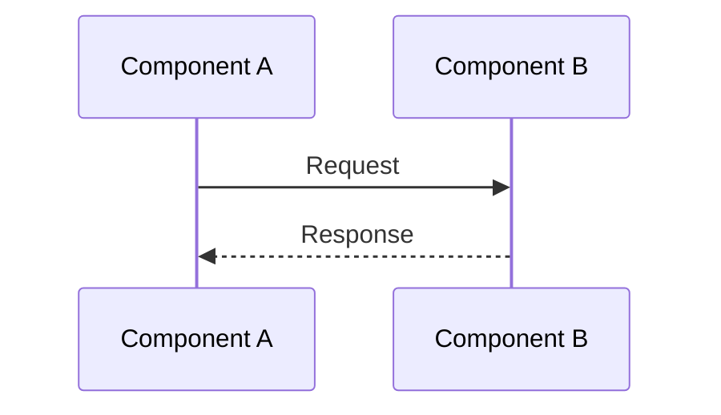

# SD-001 — {Flow Name}

> **Last Updated:** YYYY-MM-DD

## Overview

<!-- One-line description of this interaction flow -->

## Sequence Diagram

## Steps

1. —
2. —

## Error Scenarios

| Scenario | Handling |
|----------|----------|
| — | — |
