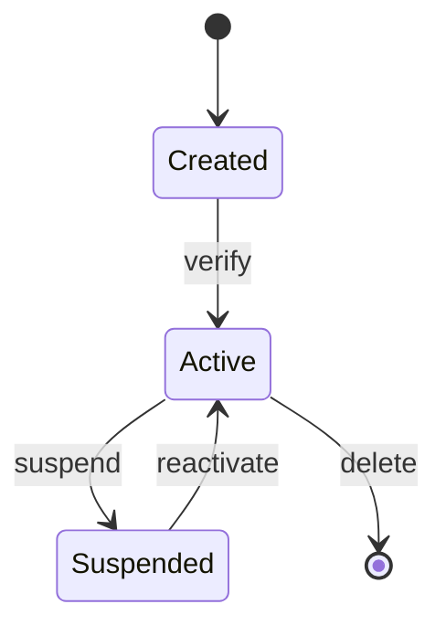

# SM-001: Template

> **Entity:** —  
> **Status:** Template  
> **Date:** 2026-03-09

## State Diagram

## Transition Rules

| From | Event | To | Guard | Action |
|------|-------|----|-------|--------|
| Created | verify | Active | Email verified | Send welcome email |
