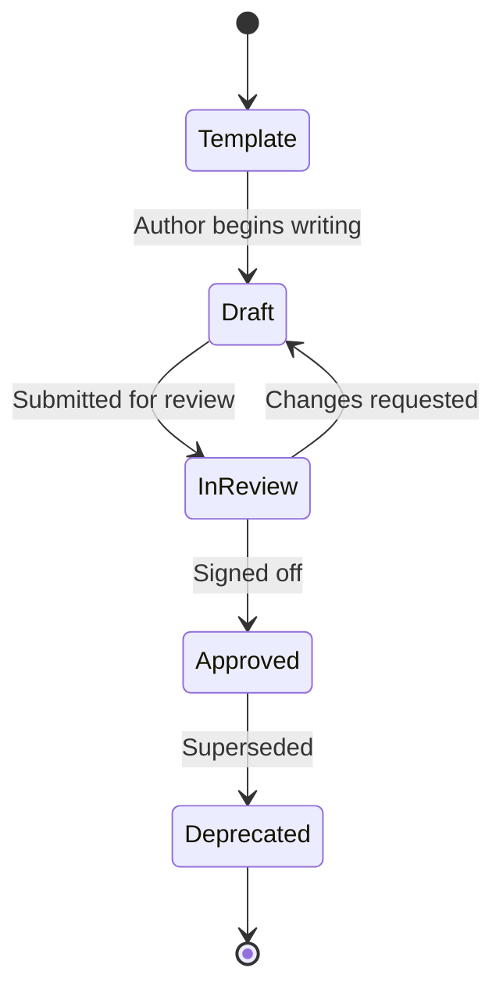

# Documentation Naming Conventions

> **Standard:** ISO/IEC/IEEE 29148:2018  
> **Last Updated:** 2026-03-09

## Purpose

Ensures all documentation artifacts follow a consistent, discoverable naming pattern across the entire `docs/` tree.

---

## Artifact Naming Patterns

| Artifact Type | Pattern | Example |
|--------------|---------|---------|
| Use cases | `UC-{###}-{short-name}.md` | `UC-001-user-login.md` |
| Architecture decisions | `ADR-{###}-{title}.md` | `ADR-003-adopt-opentelemetry.md` |
| Test specifications | `TS-{###}-{short-name}.md` | `TS-007-checkout-flow.md` |
| State models | `SM-{###}-{entity}.md` | `SM-001-order-lifecycle.md` |
| Runbooks | `RB-{###}-{scenario}.md` | `RB-002-db-failover.md` |
| Integration contracts | `IC-{###}-{partner}.md` | `IC-001-stripe-webhook.md` |
| Sequence diagrams | `SD-{###}-{flow-name}.md` | `SD-004-payment-auth.md` |
| Component specs | `CS-{###}-{component}.md` | `CS-001-ad-display.md` |
| Interaction flows | `IF-{###}-{short-name}.md` | `IF-001-admin-invite-user.md` |
| Versioned snapshots | `{artifact}-YYYY-MM-DD.md` | `brd-2025-03-09.md` |

---

## Rules

### 1. Sequential IDs

- IDs are **zero-padded to 3 digits** (e.g., `001`, `042`, `100`).
- IDs are assigned **sequentially** within each artifact type — never reused.
- When an artifact is deprecated, its ID is **retired**, not reassigned.

### 2. Short Names

- Use **lowercase kebab-case** (`user-login`, not `UserLogin` or `user_login`).
- Keep names **concise** — 2-4 words maximum.
- Use **domain language** from the [glossary](docs/_glossary.md) wherever possible.

### 3. Directory Structure
 
- All docs live under `docs/` in numbered phase directories (`01-` through `10-`).
- Sub-directories within a phase use **plural nouns** (e.g., `use-cases/`, `runbooks/`).
- Asset directories are always named `assets/`.

### 4. Phase README Convention

Every phase directory **must** contain a `README.md` following this template:

```markdown
# {Phase Name}

**Owner:** @team-or-person  
**Status:** Draft | In Review | Approved | Deprecated  
**Last Updated:** YYYY-MM-DD

## Purpose
One paragraph describing what belongs in this directory.

## Artifacts
| File | Description | Status |
|------|-------------|--------|
| `brd.md` | Business Requirements Document | Approved |

## How to Contribute
- Branch naming: `docs/{phase}/{artifact-name}`
- PRs require review from `@docs-reviewers`

## Related Directories
- Upstream: `../01-business-analysis/`
- Downstream: `../03-system-requirements/`
```

### 5. File Header Convention

Every document file **must** start with a YAML-like header block:

```markdown
# {Title}

> **Standard:** {ISO standard reference if applicable}  
> **Project:** Amafor Gladiators FC Platform  
> **Version:** {semantic version}  
> **Status:** Draft | In Review | Approved | Deprecated  
> **Author:** {name or team}  
> **Date:** YYYY-MM-DD
```

---

## Branch Naming for Documentation PRs

| PR Type | Branch Pattern | Example |
|---------|---------------|---------|
| New artifact | `docs/{phase}/{artifact-name}` | `docs/01-business-analysis/brd` |
| Update existing | `docs/{phase}/{artifact-name}-update` | `docs/04-architecture/adr-003-update` |
| Cross-phase | `docs/cross/{topic}` | `docs/cross/glossary-update` |

---

## Status Lifecycle



| Status | Icon | Meaning |
|--------|------|---------|
| Template | ⚪ | Placeholder, ISO structure only |
| Draft | 🔵 | Work-in-progress |
| In Review | 🟡 | Awaiting stakeholder approval |
| Approved | 🟢 | Baselined, authoritative |
| Deprecated | 🔴 | Superseded or retired |
